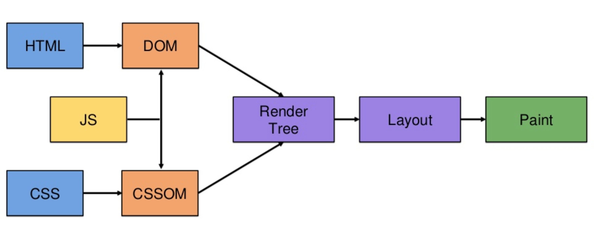

# Excercise 1.1 

When a user enters an URL in the browser, how does the browser fetch the desiredresult ? Explain this with the below in mind and Demonstrate this by drawing a diagramfor the same

- What is the main functionality of the browser?
- High Level Components of a browser.
- Rendering engine and its use.
- Parsers (HTML, CSS, etc)
- Script Processors
- Tree construction
- Order of script processing
- Layout and Painting

---

# What is the main functionality of the browser?

- User loads browser
- Type in browser https://pesto.tech
- Browser sends request to DNS Server ( Domain Name server )
- DNS finds IP address (i.e. 192.168.100.100) of pesto.tech server from its database
- Request sent to Pesto Server 
- Response sent ( HTML document ) to browser

# High Level Components of a browser

1. UI - User interface:
    
    Address bar,

    Back, Forward, Refresh buttons,

    Bookmar Menu etc.     

2. The browser engine: 
    
    A link between the user interface and the rendering engine. 

3. Rendering engine:

    The Rendering Engine renders the requested web page on the browser screen.
    Rendering engine converts HTML document and data to an visual format ( Text , image, or video ).
    
    Rendering engines used by browsers

    - Blink – Google Chrome, Opera, Microsoft Edge (previously used EdgeHTML).
    - WebKit – Safari.
    - Gecko – Mozilla Firefox.
    - Trident – Internet Explorer.
    - Presto – Legacy rendering engine for Opera.

    Note :  Browsers such as Chrome run multiple instances of the rendering engine: one for each tab. Each tab runs in a separate process.

3. Networking:

    The Networking component handles internet communication and security. 
    It retrieves the URLs using common internet protocols.

    Common Internet protocols include TCP/IP (Transmission Control Protocol/Internet Protocol), 
    UDP/IP (User Datagram Protocol/Internet Protocol), 
    HTTP (HyperText Transfer Protocol) and FTP (File Transfer Protocol).

5. UI backend:

    UI Backend helps to draw basic widgets like a select box, an input box, a window, a check box, etc. 
    It uses the device's operating system user interface methods for the same.

6. JavaScript interpreter.

    Used to parse (Interprets) and executes the JavaScript code embedded in a website. 
    The results then are sent to the rendering engine for display.

7. Data storage.

    Used to save data locally ( into browser ) including Cookies, Local Storage, Session Storage, IndexedDB, WebSQL, and FileSystem.

# Rendering engine and its use

As per above. point #3

# Parsers (HTML, CSS, etc)

    - Building the DOM tree
    - Building the CSSOM tree
    - Combining the trees into the render tree
    - Preload Scanner
    - JavaScript Compilation
    - Building the Accessibility Tree

# Script Processors
    Front end script processor 
    - HTML Parser -> DOM 
    - Js engine -> DOM
    - CSS Parser -> CSSOM

# Tree construction

Tree construction is essentially creating a tree-based of the parsed tokens and what we will be focusing on—The DOM tree.

# Order of script processing

# Layout and Painting

- Layout is the first rendering stage, where the geometry and positioning of the render tree nodes are determined. Once the render tree is built, the layout starts.

- Painting is last stage of rendering , the browser converts each box calculated in the layout phase to actual pixels on the screen

- Painting involves drawing every visual part of an element to the screen, including text, colours, borders, shadows, and replaced elements like buttons and images. The browser needs to do this super quickly

- Painting order of a block renderer is as follows:

    * background colour
    * background image
    * border
    * children
    * outline

# Reference

- [https://dev.to/gitpaulo/journey-of-a-web-page-how-browsers-work-10co#parsing](https://dev.to/gitpaulo/journey-of-a-web-page-how-browsers-work-10co#parsing)

- [https://hacks.mozilla.org/2017/09/building-the-dom-faster-speculative-parsing-async-defer-and-preload/](https://hacks.mozilla.org/2017/09/building-the-dom-faster-speculative-parsing-async-defer-and-preload/)

- [https://browsertouse.com/blog/1190/what-is-web-browser-how-it-works/](https://browsertouse.com/blog/1190/what-is-web-browser-how-it-works/)

- [https://www.ques10.com/p/19744/what-are-the-major-components-of-a-web-browser-d-1/](https://www.ques10.com/p/19744/what-are-the-major-components-of-a-web-browser-d-1/)

- [https://www.ques10.com/p/19744/what-are-the-major-components-of-a-web-browser-d-1/](https://www.ques10.com/p/19744/what-are-the-major-components-of-a-web-browser-d-1/)

- [https://data-flair.training/blogs/web-browsers/](https://data-flair.training/blogs/web-browsers/)
    
- [https://medium.com/@maneesha.wijesinghe1/what-happens-when-you-type-an-url-in-the-browser-and-press-enter-bb0aa2449c1a](https://medium.com/@maneesha.wijesinghe1/what-happens-when-you-type-an-url-in-the-browser-and-press-enter-bb0aa2449c1a)
